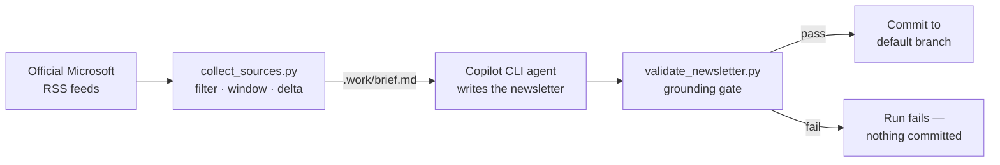

# Microsoft Foundry Weekly

Automated weekly newsletter about **Microsoft Foundry**, generated by an agent
and committed to the default branch — one file per week in
[`newsletters/`](newsletters/).

Every item is grounded in official Microsoft documentation or blogs. Nothing
else is allowed in.

## How it works



1. **Collect** — `scripts/collect_sources.py` pulls official Microsoft feeds,
   keeps only Foundry-related entries, restricts them to this week's window and
   removes everything already covered by a previous newsletter.
2. **Write** — the Copilot CLI agent reads the collected material, may fetch the
   source pages for detail, and writes a short newsletter.
3. **Validate** — `scripts/validate_newsletter.py` rejects the result if any
   link is non-Microsoft, was not collected this run, or if the newsletter is
   too long. A failure means nothing is committed.
4. **Commit** — the newsletter and the updated delta state are pushed.

Runs **Mondays at 06:00 UTC** (`.github/workflows/weekly-foundry-newsletter.yml`),
and on demand from the Actions tab.

## Sources

| Source | Feed |
| --- | --- |
| Microsoft Foundry Blog | `devblogs.microsoft.com/foundry/feed/` |
| Azure Blog | `azure.microsoft.com/en-us/blog/feed/` |
| Azure Updates | `microsoft.com/releasecommunications/api/v2/azure/rss` |
| Microsoft Learn (reference, agent-fetched) | *What's new in Azure AI Foundry*, AI Foundry pricing |

## What each newsletter covers

New features · preview → GA · models added and removed · pricing changes ·
new regions · anything else important.

Sections with nothing to report are omitted. A week with no Foundry news
produces **no file** rather than an empty one.

## Setup

The agent needs a token, because `GITHUB_TOKEN` cannot call Copilot.

1. Create a **fine-grained personal access token** with the **Copilot Requests**
   permission. Classic `ghp_` tokens are not supported.
2. Add it to this repository as a secret named **`COPILOT_CLI_TOKEN`**
   (*Settings → Secrets and variables → Actions*).
3. Allow Actions to push: *Settings → Actions → General → Workflow permissions* →
   **Read and write permissions**.

The workflow pushes to whichever branch it runs on (`GITHUB_REF_NAME`), so it
follows the repository's default branch automatically. If that branch is
protected, allow `github-actions[bot]` to bypass the restriction.

## Running it manually

From the **Actions** tab, run *Weekly Microsoft Foundry Newsletter* with
optional inputs:

| Input | Effect |
| --- | --- |
| `since` | Override the window start (`YYYY-MM-DD`) |
| `until` | Override the window end, exclusive (`YYYY-MM-DD`) |
| `force` | Re-collect the window even if items were already covered |
| `dry_run` | Generate and validate, but commit nothing |

> **"No new Microsoft Foundry news this week"** means every matching item in the
> window had already been published in an earlier newsletter — the delta was
> empty, so no file was written. That is normal. To rebuild a week anyway, re-run
> with **`force`** enabled.

Locally:

```bash
python scripts/collect_sources.py --since 2026-09-01
copilot --prompt "Read .github/newsletter-brief.md and follow it exactly. Then read .work/brief.md and write the newsletter to newsletters/2026-W39.md." \
  --allow-tool 'read' --allow-tool 'write(newsletters/2026-W39.md)' \
  --allow-tool 'url(https://devblogs.microsoft.com)' \
  --allow-tool 'url(https://azure.microsoft.com)' \
  --allow-tool 'url(https://learn.microsoft.com)' \
  --allow-tool 'url(https://techcommunity.microsoft.com)' \
  --deny-tool 'shell' --no-ask-user --silent
python scripts/validate_newsletter.py newsletters/2026-W39.md
```

## Delta tracking

`state/seen-items.json` records the URL of every item ever covered, plus the
end of the last window. A newsletter therefore only ever contains genuinely new
items — re-running a past window produces nothing, and a missed week is picked
up automatically on the next run.

Rebuilding an older week (`force` + `since`/`until`) never rewinds the cursor,
so the next scheduled run still resumes from the most recent point.

## Tuning

| Want to change | Edit |
| --- | --- |
| Tone, structure, what to drop | `.github/newsletter-brief.md` |
| Feeds, Foundry filter, categories | `scripts/collect_sources.py` |
| Allowed domains, length limit | `scripts/validate_newsletter.py` |
| Schedule, model | `.github/workflows/weekly-foundry-newsletter.yml` |
